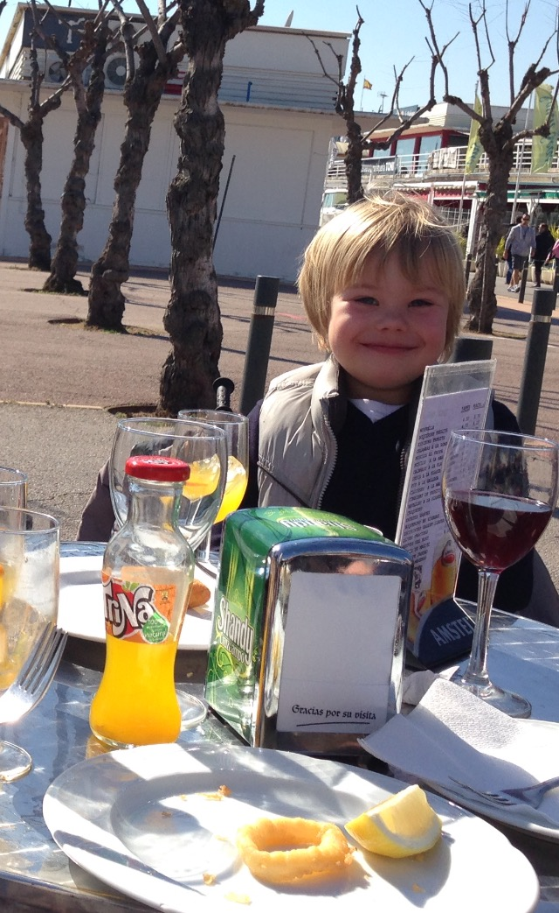
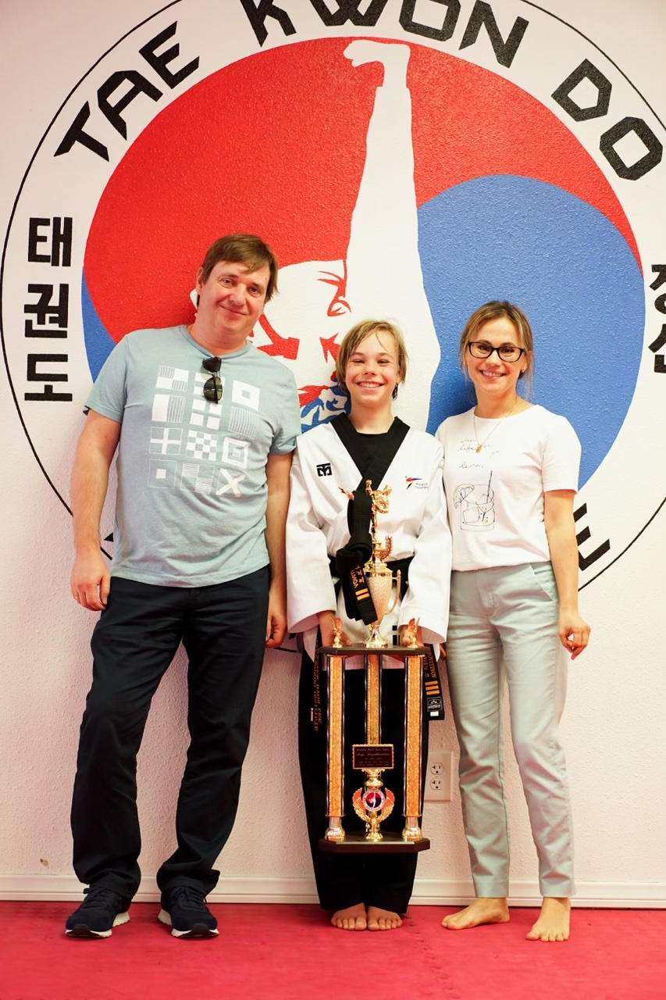

<h1>Sergi Serpukhovitinov's Page</h1>
 
<h3> All you need to know about me: </h3>
 

<h2 id="marginplus">Background:</h2>

Hi, my name is Sergi and here's a little bit about me. I was born in Mataro, Spain on July 12, 2008. I am an only child and I don’t have any pets. My mom’s name is Anna, and my dad’s name is Eugene. Both my mom and dad were born in Russia, yet, met each other in Spain after they immigrated by themselves at a young age! I lived in Spain for over 10 years and recently moved to the U.S. in 2018. Some fun facts about me: I speak four languages, do Taekwondo professionally and I LOVE eating and playing games. I will eat just about anything you name (if it’s edible). Some of my hobbies are: fishing, sports, games, hanging out with friends, and attempting to learn new things. Stay tuned for more posts about me! 

   
## Struggles: 
 
At the beginning of the course after downloading all necessary extensions and getting all the tools ready, I found out that in the version checks, my python 3 wasn’t detected, so I had to fix that issue by making sure everything was set to python 3. After solving this issue and using bundle install to acquire all gems, I was ready to start a localhost server to start working on my project. However, the make command wouldn’t work and an “Error 1” kept coming up. This issue was shortly solved after using an ln -s command that fixed the issue with nbconvert. Shortly, I was back with the ability to code. Unfortunately, after running a localhost server and being ready to code, I wasn’t able to edit any of my files. I solved this solution by always using “shift I” right before starting as it allowed me to insert my own code.  Now, I am able to code freely anywhere, anytime!

  

      

        <h1>2048</h1>
        

          
score

          0
        

      

      Join the numbers and get to the <b>2048</b> tile!
      

    

